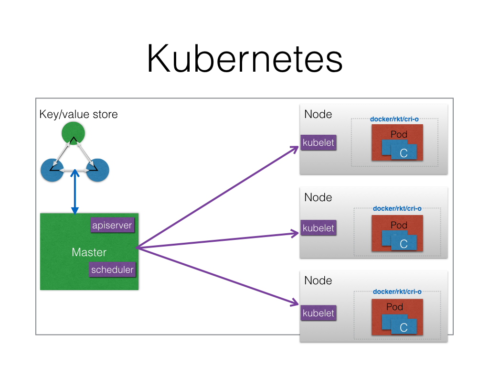
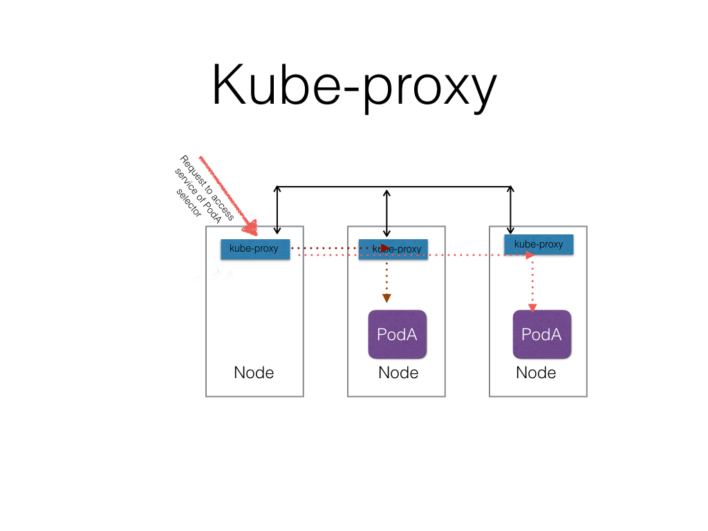
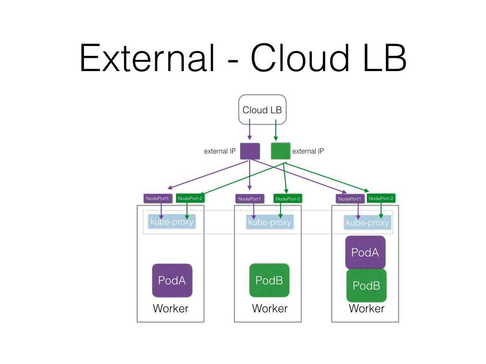

## Architecture 


### Components

#### Master
##### Apiserver
##### Schedulder

#### Nodes
### Kubelet
### kube-proxy
### Container Engine

#### Key/Value Store

### Key Concepts
- Containers
- Pod
- Label
- Selector
- Replication Controllers
- Replica Sets
- Deployment
- Services
- Volumes

### Advance Resources
- Namespaces
- ConfigMaps
- Secrets
- Batch Jobs
- PetSets
- DaemoncSet
- Ingress 


### Defining an application 

#### RSVP Application
##### Deployments
###### MongoDB
```
apiVersion: extensions/v1beta1
kind: Deployment
metadata:
  name: rsvp-db
spec:
  replicas: 1
  template:
    metadata:
      labels:
        appdb: rsvpdb
    spec:
      containers:
      - name: rsvpd-db
        image: mongo:3.3
        env:
        - name: MONGODB_DATABASE
          value: rsvpdata
        ports:
        - containerPort: 27017
```
###### RSVP App
```
apiVersion: extensions/v1beta1
kind: Deployment
metadata:
  name: rsvp
spec:
  replicas: 2
  template:
    metadata:
      labels:
        app: rsvp
    spec:
      containers:
      - name: rsvp-app
        image: teamcloudyuga/rsvpapp
        env:
        - name: MONGODB_HOST
          value: mongodb
        ports:
        - containerPort: 5000
```

##### Services

###### MongoDB
```
apiVersion: v1
kind: Service
metadata:
  name: mongodb
  labels:
    app: rsvpdb
spec:
  ports:
  - port: 27017
    protocol: TCP
  selector:
    appdb: rsvpdb
```


###### RSVP App
```
apiVersion: v1
kind: Service
metadata:
  name: rsvp
  labels:
    app: rsvp
spec:
  type: NodePort 
  ports:
  - port: 80
    targetPort: 5000
    protocol: TCP
  selector:
    app: rsvp
```

#### High availablity of application 
- Pods Replicas
- Multiple nodes
- Multiple master

#### Service discovery of applications 
- Services get registred with a DNS, which each node can access. 
- With default installation, *kube-dns* service get delpoyed which
 - registers new service's VIP
 - resolves name to VIP 

#### Load Balancing an application
- Internal
  - kube-proxy

- External


#### Autoscaling an application 
- Horizontal Pod Scaling 
 - Based on CPU usage now which uses heapster to collect CPU utilization.
 - Custom matrics support is coming

#### Rolling upgrade and rollback of an application 
- Using Deployments

#### Internally connecting to other application 
- using serivce VIP  

#### Networking option to connect applications with-in the cluster  
- Flat Networking
- All containers talks to other containers without NAT

#### Accessing the application from external world 
- LoadBalancer (requires Cloud Provider's support)
- NodePort
- External IP
- Igress

#### Managing storage for application
- Volumes are per pod. Even if container in a pod goes down, volume exists.
- To use a volume, a pod specifies what volumes to provide for the pod (the
[`spec.volumes`](http://kubernetes.io/kubernetes/third_party/swagger-ui/#!/v1/createPod)
field) and where to mount those into containers(the
[`spec.containers.volumeMounts`](http://kubernetes.io/kubernetes/third_party/swagger-ui/#!/v1/createPod)
field).

#####  Supported Volumes
   * `emptyDir`
   * `hostPath`
   * `gcePersistentDisk`
   * `awsElasticBlockStore`
   * `nfs`
   * `iscsi`
   * `flocker`
   * `glusterfs`
   * `rbd`
   * `cephfs`
   * `gitRepo`
   * `secret`
   * `persistentVolumeClaim`
   * `downwardAPI`
   * `azureFileVolume`
   * `vsphereVolume`


## Demo 

### Download *kubectl*

```
$ curl -O  https://storage.googleapis.com/kubernetes-release/release/v1.3.5/bin/linux/amd64/kubectl
$ chmod +x kubectl
$ mv kubectl /usr/local/bin/kubectl
```

### Configure *kubectl*
- Copy the share config file inside ~/.kube 
```
$ mkdie ~/.kube
$ cp <PATH>/config ~/.kube
```

### Create the namespace 
```
$ kubectl create namespace <username>
```

### Get the current context
```
$ export CONTEXT=`kubectl config view | awk '/current-context/ {print $2}'`
```

### Update the default namespace for the current context 
```
$ kubectl config set-context $CONTEXT --namespace=<username>
```


### Create a deployment
```
$ kubectl run my-nginx --image=nginx --replicas=2 --port=80
```

### List the pods and deployments
```
$ kubectl get pods
$ kubectl get deployments
```

### Create a service and expose it using *NodePort*
```
$ kubectl expose deployment my-nginx --port=80 --type=NodePort
```

### List the service
```
$ kubectl get services
```

### Acccess the sevice using NodePort

### Delete service and deloyment
```
$ kubectl delete svc my-nginx  
$ kubectl delete deployment my-nginx
```

#### Deploying RSVP app

##### Clone the repo
```
$ git clone https://github.com/cloudyuga/container-orchestration.git
$ cd container-orchestration/k8s
```

##### Create db
```
$ kubectl create -f rsvp-db.yaml
$ kubectl create -f rsvp-db-service.yaml
```

##### Create web frontend
```
$ kubectl create -f rsvp-web.yaml
$ kubectl create -f rsvp-web-service.yaml
```

### List 
```
$ kubectl get deployments
$ kubectl get svc
``` 

### Scale 
```
$ kubectl scale --replicas=4 deployments/rsvp
```

### Delete
```
$ kubectl delete deployments/rsvp deployments/rsvp-db
$ kubectl delete svc/mongodb svc/rsvp
```

